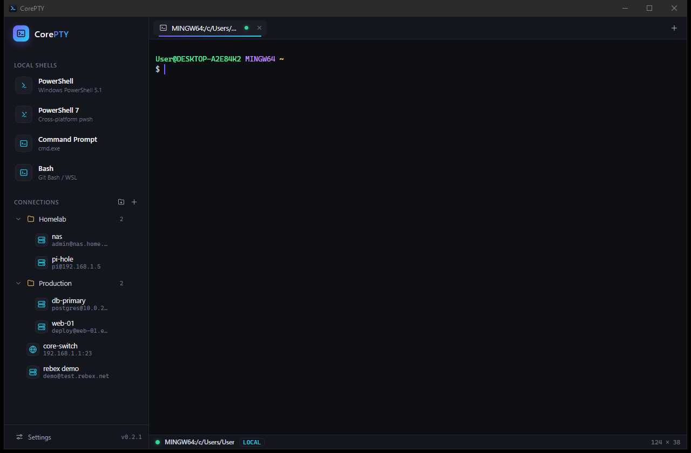
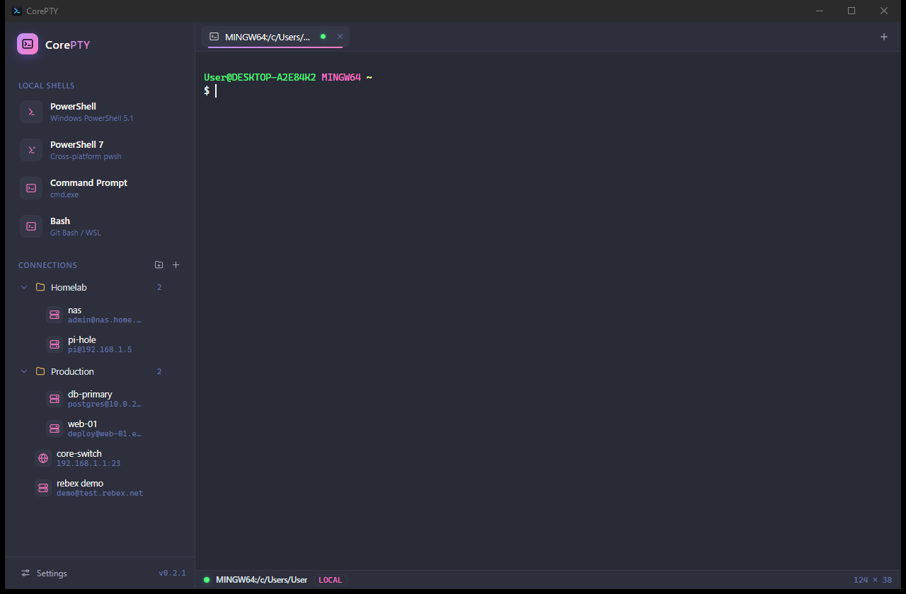
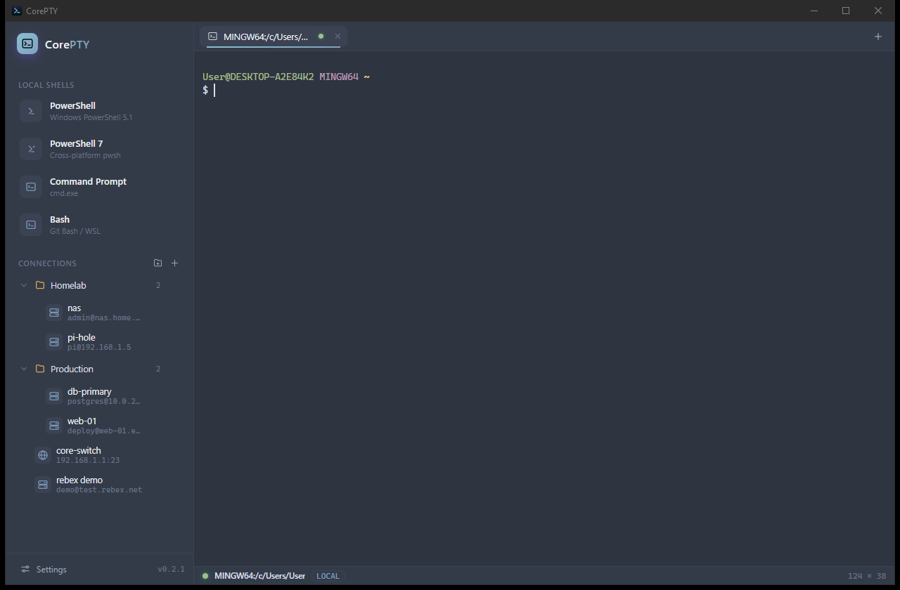
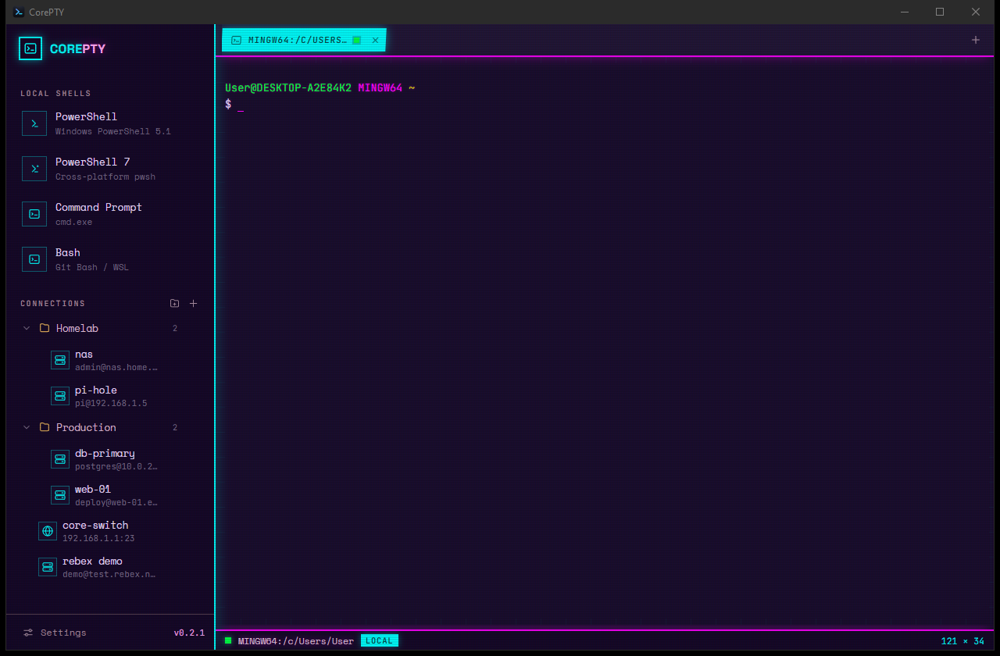
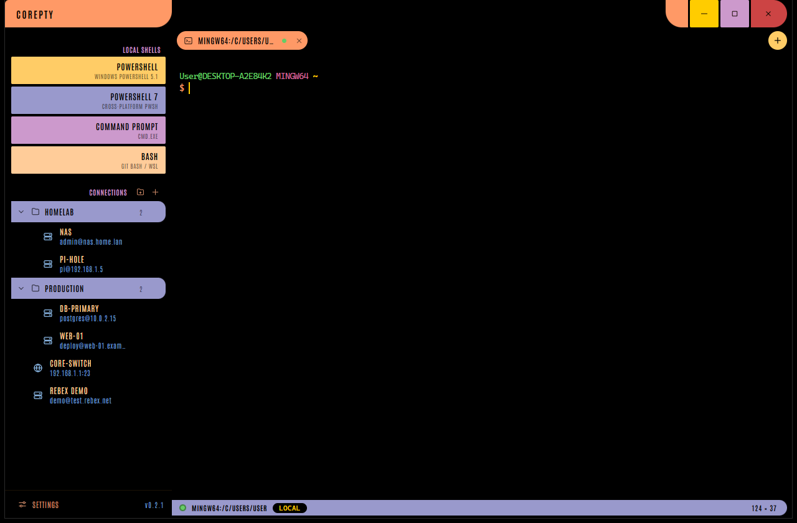
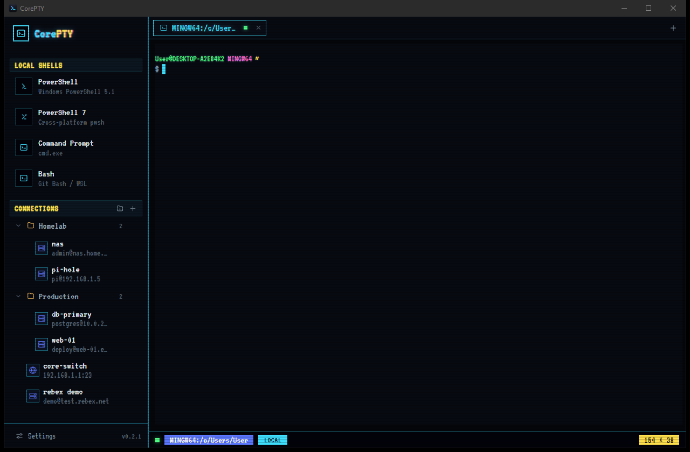

<div align="center">
  

  <h1>CorePTY</h1>

  <p>
    <b>A slick, modern, cross-platform multi-terminal.</b><br/>
    Local shells, SSH &amp; Telnet — tabbed, themeable, and dark by default.
  </p>

  <p>
    <a href="https://github.com/daniel-leicht/CorePTY/actions/workflows/release-windows.yml"></a>
    <a href="https://github.com/daniel-leicht/CorePTY/releases/latest"></a>
    <a href="https://github.com/daniel-leicht/CorePTY/releases"></a>
    <a href="LICENSE"></a>
    
  </p>

  
</div>

<br/>

**CorePTY** is a tabbed terminal client in the **MobaXterm / SecureCRT** lineage, built with a
**Rust** core and a **web-tech UI** ([Tauri&nbsp;2](https://tauri.app) + [xterm.js](https://xtermjs.org)).
It opens local shells, SSH, and Telnet sessions side by side, stores credentials in the OS
keychain, and authenticates SSH with passwords or private keys — all in a footprint measured
in **single-digit megabytes** (native WebView2, no bundled Chromium).

---

## ✨ Highlights

- **🖥️ Local terminals** — Windows PowerShell, PowerShell 7, Command Prompt, and Bash
  (Git Bash / WSL), backed by real PTYs (ConPTY via [`portable-pty`](https://crates.io/crates/portable-pty)).
- **🔐 SSH** — pure-Rust [`russh`](https://crates.io/crates/russh); password **and** private-key
  auth (with passphrase), `~/.ssh/known_hosts` verification (trust-on-first-use), and live resize.
- **📡 Telnet** — a hand-rolled client with proper IAC option negotiation (SGA, ECHO,
  TERMINAL-TYPE → `xterm-256color`, NAWS window-size reporting).
- **🛡️ Run as Administrator** — right-click a shell to open an **elevated tab** in the same
  window (a UAC broker relays an elevated ConPTY over an admins-only named pipe); admin tabs
  are marked with a shield.
- **🗂️ Organized connections** — a folder / subfolder tree in the sidebar with drag-and-drop,
  inline rename, context menus, and per-folder counts.
- **🔑 Safe secrets** — passwords and key passphrases live **only** in the OS keychain
  (Windows Credential Manager), never in plaintext on disk.
- **🏷️ Smart tab titles** — tabs follow the title a program or remote shell sets via `OSC 0/2`
  (like Windows Terminal). Double-click a tab to pin a custom name; right-click to
  **Duplicate**; hover for the full title.
- **🎨 Eight themes** — modern, classic, and three CRT-flavored retro themes, switched live
  ([see below](#-themes)).
- **♻️ Reconnect** — when a session drops, an in-terminal overlay offers one-click reconnect in
  the same tab (`Ctrl+Shift+R`).
- **⚙️ Live settings** — font size/family, cursor, scrollback, bell, **minimum contrast**
  (auto-rescues unreadable color pairs), copy-on-select, and right-click behavior.

---

## 🎨 Themes

Eight built-in themes, switched live from **Settings** — each restyles the **whole app**: UI
palette, terminal ANSI colors, fonts (self-hosted, offline), CRT effects, and even the window
chrome (Starbase goes frameless).

<table>
  <tr>
    <td align="center" width="50%"><br/><sub><b>CorePTY&nbsp;Dark</b> — the default</sub></td>
    <td align="center" width="50%"><br/><sub><b>Dracula</b></sub></td>
  </tr>
  <tr>
    <td align="center" width="50%"><br/><sub><b>Nord</b></sub></td>
    <td align="center" width="50%"><br/><sub><b>Synapse</b> — synthwave neon on a violet void</sub></td>
  </tr>
  <tr>
    <td align="center" width="50%"><br/><sub><b>Starbase</b> — an LCARS starship console (frameless)</sub></td>
    <td align="center" width="50%"><br/><sub><b>BBS</b> — a 1990s bulletin board on a scanlined CRT</sub></td>
  </tr>
</table>

<sub>Also included: <b>CorePTY Light</b> and <b>Solarized Dark</b>. The three retro themes
(BBS, Synapse, Starbase) are ported from the <em>esper-theme</em> collection — box-drawing
panel corners, phosphor glow, scanlines, condensed all-caps type, and pill-shaped LCARS
controls.</sub>

---

## ⬇️ Download

Prebuilt **Windows (64-bit)** binaries are attached to every [**Release**](https://github.com/daniel-leicht/CorePTY/releases/latest):

| Download | What it is |
|---|---|
| **`CorePTY_<version>_x64-setup.exe`** | Installer — Start-menu shortcut, uninstaller, and it provisions the WebView2 runtime if missing. |
| **`CorePTY_<version>_x64-portable.exe`** | Portable — a single self-contained executable, no install. Needs the Edge **WebView2** runtime (preinstalled on Windows 11 and current Windows 10). |

> Prefer to build it yourself? See [Build from source](#-build-from-source).

---

## ⌨️ Keyboard shortcuts

| Shortcut | Action |
|---|---|
| `Ctrl+Shift+T` | New local terminal (default shell) |
| `Ctrl+Shift+N` | New SSH / Telnet connection |
| `Ctrl+Shift+W` | Close the current tab |
| `Ctrl+Shift+R` | Reconnect the active session |
| `Ctrl+Shift+F` | Search the terminal buffer |
| `Ctrl+,` | Open settings |
| `Ctrl+Shift+C` / `Ctrl+Shift+V` | Copy selection / paste |
| `Ctrl+Tab` / `Ctrl+PageUp` · `PageDown` | Cycle tabs |
| Double-click a tab | Rename (pins the name) |
| Right-click a shell / tab | Run as Administrator · Duplicate · … |
| Drag a connection / folder | Move it between folders |

---

## 🛠️ Tech stack

| Layer | Choice |
|---|---|
| Shell / windowing | [Tauri&nbsp;2](https://tauri.app) (Rust, native WebView2 — no bundled Chromium) |
| Terminal renderer | [xterm.js](https://xtermjs.org) 5 + fit / web-links / search addons |
| Local PTY | [`portable-pty`](https://crates.io/crates/portable-pty) (ConPTY / openpty) |
| SSH | [`russh`](https://crates.io/crates/russh) (`ring` crypto backend — no NASM required) |
| Telnet | custom IAC state machine over `tokio` TCP |
| Credentials | [`keyring`](https://crates.io/crates/keyring) → OS keychain |
| Config | TOML (connections) + JSON (settings) in the app config dir |

---

## 🧑‍💻 Build from source

**Prerequisites**

- **Rust** (stable, MSVC toolchain on Windows) + the **Visual C++ Build Tools** — `ring` ships
  pre-generated assembly, so **no NASM required**.
- **Node.js 18+**.

```bash
npm install            # frontend deps
npm run tauri dev      # run the app with hot reload
npm run tauri build    # produce a release bundle / installer
```

**Releases** are cut by pushing a version tag — the
[Build &amp; Release workflow](.github/workflows/release-windows.yml) builds the Windows x64
installer + portable exe on GitHub's runners and attaches them to a new GitHub Release. Bump the
version in `src-tauri/tauri.conf.json` (and `Cargo.toml` / `package.json` to match), then:

```bash
git tag v0.2.0 && git push origin v0.2.0
```

---

## 🔐 Security

- Passwords and key passphrases are stored **only** in the OS keychain, never in the TOML
  profile file.
- SSH host keys are verified against `~/.ssh/known_hosts`. Unknown hosts are trusted on first
  use and recorded; a **changed** host key is refused (possible MITM).
- **Elevated tabs** run behind a broker over a named pipe whose ACL only grants
  Administrators — a non-elevated process can't hijack the admin shell. (As with any terminal
  that hosts admin tabs, the app process can drive that elevated shell; that's the intent.)

---

## 🗺️ Roadmap

Natural next steps on the same core: SFTP/SCP file browser, split panes, serial connections,
port-forwarding / tunnels, session logging, an interactive host-key prompt, broadcast-to-all-tabs,
and manual drag-to-reorder within a folder.

---

## 📄 License

CorePTY is free software, licensed under the **GNU General Public License v3.0 or later**
(`GPL-3.0-or-later`). Copyright © 2026 Daniel Leicht. See [LICENSE](LICENSE) for the full text.

---

<details>
<summary><b>Appendix — original feasibility analysis</b> (the study that scoped this project)</summary>

### Short version

A genuinely useful MVP is a **few-months job for a small team**; matching MobaXterm or
SecureCRT feature-for-feature is a **multi-year product**. The historically hard part —
terminal emulation and PTY handling — is now solved by mature open-source libraries. What's
left is a long tail of protocol features, file transfer, per-OS polish, security, and packaging
that those 15–20-year-old products have accumulated.

### What these apps actually are (the surface area)

Both are really *four* products fused together: a **terminal emulator**, a **connection layer**
(SSH/telnet/serial/…), a **cross-platform GUI shell** (tabs/panes/session tree), and a
**file-transfer + tooling suite**. MobaXterm goes further with a bundled X11 server, RDP/VNC,
and Cygwin tools.

### Difficulty by component

| Component | Difficulty | Why — and what to reuse instead of writing |
|---|---|---|
| **Terminal emulation** (VT100/220, xterm, ANSI, 256/truecolor, mouse, bracketed paste) | Easy *if you don't write it* | Use `xterm.js` (what VS Code uses), or Rust `alacritty_terminal`/`vte`. Writing your own VT parser is the classic trap. |
| **Local shell / PTY** | Easy now | `ConPTY` on Windows (Win10 1809+ made this sane), `node-pty` or Rust `portable-pty` wrap all three OSes. |
| **SSH** | Medium | `ssh2` (Node), `russh` (Rust), `libssh2`, Paramiko (Py). Auth methods, agent forwarding, ProxyJump, keepalives are the fiddly bits. |
| **Tabs / split panes / session tree GUI** | Medium | Framework-dependent; the UX polish (drag-to-split, reconnect, broadcast) is where time goes. |
| **SFTP/SCP browser synced to a session** | Medium | Protocol is easy; a good dual-pane file browser with transfers/queue is real UI work. |
| **Serial, telnet, tunnels/port-forwarding** | Medium | Libraries exist (`serialport`); mostly plumbing + UI. |
| **Credential storage** | Medium | OS keychains. Don't roll your own crypto storage. |
| **Zmodem / rz-sz transfers** | Medium-hard | Fewer libraries; often hand-rolled. |
| **X11 server** (MobaXterm) | Hard / avoid | Don't write one — bundle VcXsrv-style. |
| **RDP/VNC embedding** (MobaXterm) | Hard | FreeRDP integration is substantial. |
| **Scripting/automation** (SecureCRT) | Hard | A stable automation API is a large, ongoing commitment. |
| **The long tail**: vim/tmux/htop compat, huge scrollback perf, per-OS copy-paste quirks, code signing + notarization + auto-update | Hard, never "done" | The decade of polish that makes commercial products feel solid. |

### Recommended path

**Tauri or Electron + xterm.js** frontend, with a PTY backend (local) and an SSH library
(remote) — the Hyper / VS Code-terminal lineage. Tauri if you care about memory footprint.

> CorePTY took the recommended path (Tauri + xterm.js) with a Rust connection core
> (`portable-pty` + `russh` + a custom telnet client).

### Realistic effort

- **Tabbed SSH + local shell + basic SFTP, cross-platform, self-signed builds** →
  ~**2–4 months**, 1–2 devs.
- **Session manager, keychain, tunnels, serial, split panes, logging, signed/notarized
  installers, auto-update** → add **6–12 months**.
- **Approaching MobaXterm/SecureCRT parity** (X11, RDP/VNC, scripting, enterprise auth) →
  **multiple years**, and arguably never truly "done."

</details>
