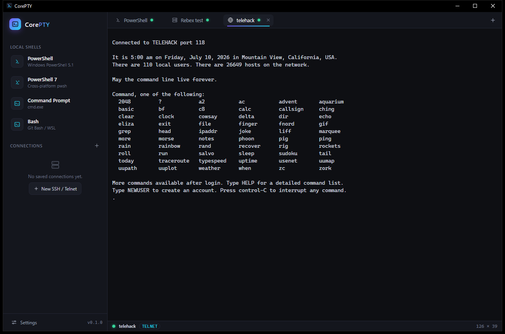

<div align="center">
  
  <h1>CorePTY</h1>
  <p><em>A slick, modern, cross-platform multi-terminal — local shells, SSH &amp; Telnet in one dark-mode app.</em></p>
</div>



CorePTY is a tabbed terminal client in the MobaXterm / SecureCRT lineage, built with a
**Rust** core and a **web-tech UI** (Tauri + xterm.js). It opens local shells, SSH, and
Telnet sessions side-by-side, stores credentials in the OS keychain, and authenticates
SSH with passwords or private keys.

## Features

- **Local terminals** — Windows PowerShell, PowerShell 7, Command Prompt, and Bash
  (Git Bash / WSL), backed by real PTYs (ConPTY on Windows via `portable-pty`).
- **SSH** — pure-Rust `russh`; password **and** private-key auth (with passphrase),
  host-key verification against `~/.ssh/known_hosts` (trust-on-first-use), PTY + shell,
  and live window resize.
- **Telnet** — hand-rolled client with proper IAC option negotiation (SGA, ECHO,
  TERMINAL-TYPE → `xterm-256color`, and NAWS window-size reporting).
- **Safe password saving** — secrets live in the **OS keychain** (Windows Credential
  Manager via `keyring`), never in plaintext. Connection profiles are stored as TOML in
  the app config dir; secrets are keyed by profile id.
- **Organized connections** — a folder / subfolder tree in the sidebar with nesting,
  drag-and-drop to reorganize, inline rename, context menus, and per-folder counts.
- **Reconnect** — when a session drops or exits, an in-terminal overlay offers a
  one-click reconnect (reusing the same tab); `Ctrl+Shift+R` reconnects the active tab.
- **Themes** — eight built-in themes, switched live from Settings: CorePTY Dark /
  Light, Dracula, Nord, Solarized Dark, and three retro themes ported from the
  *esper-theme* collection — **BBS** (VT323 CRT with scanlines, phosphor glow, and
  box-drawing panel corners), **Synapse** (synthwave neon on a violet void, cyber-grid
  + scanlines), and **Starbase** (an LCARS starship console — orange-on-black, condensed
  all-caps Antonio, pill-shaped controls). Each restyles the whole app — UI palette,
  terminal ANSI colors, fonts (self-hosted, offline), effects, and component treatments.
- **Settings** — live-applied font size/family, cursor style/blink, scrollback, default
  shell, bell, copy-on-select, and right-click behavior, persisted to `settings.json`.
- **Slick dark UI** — session sidebar with quick-launch, tabbed terminals with live
  connection status, a native connection dialog (with a real file picker for keys),
  buffer search, auto-copy-on-select, right-click paste, and toasts.

## Keyboard shortcuts

| Shortcut | Action |
|---|---|
| `Ctrl+Shift+T` | New local terminal (default shell) |
| `Ctrl+Shift+N` | New SSH / Telnet connection |
| `Ctrl+Shift+W` | Close current tab |
| `Ctrl+Shift+R` | Reconnect the active session |
| `Ctrl+Shift+F` | Search the terminal buffer |
| `Ctrl+,` | Open settings |
| `Ctrl+Shift+C` / `Ctrl+Shift+V` | Copy selection / paste |
| `Ctrl+Tab` / `Ctrl+PageUp/Down` | Cycle tabs |
| Right-click | Paste, or a copy/paste menu (configurable) |
| Drag a connection/folder | Move it between folders |

## Tech stack

| Layer | Choice |
|---|---|
| Shell / windowing | [Tauri 2](https://tauri.app) (Rust, native WebView2 — no bundled Chromium) |
| Terminal renderer | [xterm.js](https://xtermjs.org) 5 + fit / web-links / search addons |
| Local PTY | [`portable-pty`](https://crates.io/crates/portable-pty) (ConPTY / openpty) |
| SSH | [`russh`](https://crates.io/crates/russh) (`ring` crypto backend) |
| Telnet | custom IAC state machine over `tokio` TCP |
| Credentials | [`keyring`](https://crates.io/crates/keyring) → OS keychain |
| Config | TOML in the app config dir |

## Project layout

```
CorePTY/
├── src/                    # Frontend (TypeScript, xterm.js)
│   ├── app.ts              #   app shell: sidebar, tabs, stage, events
│   ├── terminal.ts         #   xterm.js session wrapper + reconnect overlay
│   ├── connections.ts      #   folder/subfolder connections tree
│   ├── dialog.ts           #   SSH/Telnet connection dialog
│   ├── settings.ts         #   settings schema, persistence, live apply
│   ├── settings-dialog.ts  #   settings modal + theme picker
│   ├── themes.ts           #   theme definitions (palette, ANSI, fonts, effects)
│   ├── spec.ts             #   per-tab launch spec (for reconnect)
│   ├── ipc.ts              #   typed Tauri command / event bridge
│   ├── menu.ts             #   floating context-menu primitive
│   ├── util.ts             #   shared helpers (uuid, escapeHtml)
│   ├── icons.ts            #   inline SVG icon set
│   └── styles.css          #   design tokens + dark theme
├── src-tauri/              # Backend (Rust)
│   ├── src/session/        #   session core + local / ssh / telnet drivers
│   ├── src/store.rs        #   keychain secrets + saved-session TOML
│   ├── src/commands.rs     #   Tauri command surface
│   └── tauri.conf.json
└── scripts/gen-icon.mjs    # Dependency-free PNG app-icon generator
```

## Prerequisites

- **Rust** (stable, MSVC toolchain on Windows) + the **Visual C++ Build Tools** (for the
  MSVC linker) — `ring` ships pre-generated assembly, so **no NASM required**.
- **Node.js 18+**.

## Develop & build

```bash
npm install            # frontend deps
npm run tauri dev      # run the app with hot reload
npm run tauri build    # produce a release bundle / installer
```

## Security notes

- Passwords and key passphrases are stored **only** in the OS keychain, never in the
  TOML profile file.
- SSH host keys are verified against `~/.ssh/known_hosts`. Unknown hosts are trusted on
  first use and recorded; a **changed** host key is refused (possible MITM).

## Roadmap

Not yet implemented (natural next steps on the same core): SFTP/SCP file browser, split
panes, serial connections, port-forwarding/tunnels, session logging, an interactive
host-key prompt, broadcast-to-all-tabs, and manual drag-to-reorder within a folder.

## License

CorePTY is free software, licensed under the **GNU General Public License v3.0 or
later** (`GPL-3.0-or-later`). Copyright © 2026 Daniel Leicht. See [LICENSE](LICENSE)
for the full text.

---

## Appendix — original feasibility analysis

*The analysis that scoped this project.*

### Short version

A genuinely useful MVP is a **few-months job for a small team**; matching MobaXterm
or SecureCRT feature-for-feature is a **multi-year product**. The historically hard
part — terminal emulation and PTY handling — is now solved by mature open-source
libraries. What's left is a long tail of protocol features, file transfer, per-OS
polish, security, and packaging that those 15–20-year-old products have accumulated.

### What these apps actually are (the surface area)

Both are really *four* products fused together: a **terminal emulator**, a
**connection layer** (SSH/telnet/serial/…), a **cross-platform GUI shell**
(tabs/panes/session tree), and a **file-transfer + tooling suite**. MobaXterm goes
further with a bundled X11 server, RDP/VNC, and Cygwin tools.

### Difficulty by component

| Component | Difficulty | Why — and what to reuse instead of writing |
|---|---|---|
| **Terminal emulation** (VT100/220, xterm, ANSI, 256/truecolor, mouse, bracketed paste) | Easy *if you don't write it* | Use `xterm.js` (what VS Code uses), or Rust `alacritty_terminal`/`vte`, or `QTermWidget`. Writing your own VT parser is the classic trap. |
| **Local shell / PTY** | Easy now | `ConPTY` on Windows (Win10 1809+ made this sane — pre-ConPTY was misery), `node-pty` or Rust `portable-pty` wrap all three OSes. |
| **SSH** | Medium | `ssh2` (Node), `russh` (Rust), `libssh2`, Paramiko (Py). Auth methods, agent forwarding, ProxyJump, keepalives are the fiddly bits. |
| **Tabs / split panes / session tree GUI** | Medium | Framework-dependent; the UX polish (drag-to-split, reconnect, broadcast-to-all-tabs) is where time goes. |
| **SFTP/SCP browser synced to a session** | Medium | Protocol is easy; a good dual-pane file browser with transfers/queue is real UI work. |
| **Serial, telnet, tunnels/port-forwarding** | Medium | Libraries exist (`serialport`); mostly plumbing + UI. |
| **Credential storage** | Medium | OS keychains: Windows Credential Manager, macOS Keychain, Linux libsecret. Don't roll your own crypto storage. |
| **Zmodem / rz-sz transfers** (SecureCRT signature) | Medium-hard | Fewer libraries; often hand-rolled. |
| **X11 server** (MobaXterm) | Hard / avoid | Don't write one — bundle VcXsrv-style. This alone is a project. |
| **RDP/VNC embedding** (MobaXterm) | Hard | FreeRDP integration is substantial. |
| **Scripting/automation** (SecureCRT's Python/VBScript) | Hard | Designing a stable automation API is a large, ongoing commitment. |
| **The long tail**: perfect compatibility with vim/tmux/htop/ncurses, huge scrollback perf, per-OS copy-paste quirks, code signing + macOS notarization + auto-update | Hard, never "done" | This is the decade of polish that makes commercial products feel solid. |

### Recommended paths

**Fastest cross-platform (recommended):** Tauri or Electron + **xterm.js** frontend,
with `node-pty` (local) and `ssh2` (remote) in the backend. This is the Hyper /
VS Code-terminal lineage — best-tested renderer, quickest to a demo. Tauri if you
care about memory footprint; Electron if you want the largest ecosystem.

**Native/performance path:** Rust + `alacritty_terminal` + `portable-pty` + `russh`,
GPU rendering. **Study or fork [WezTerm](https://github.com/wez/wezterm)** — it's an
open-source, cross-platform, GPU-accelerated multiplexer with tabs, panes, and SSH,
largely built by one person. It's proof the *core* is tractable solo, and a huge
head start.

**Qt path:** C++/Qt + `QTermWidget`. Battle-tested cross-platform GUI, but more
boilerplate and an older terminal widget.

> CorePTY took the recommended path (Tauri + xterm.js) with a Rust connection core
> (`portable-pty` + `russh` + a custom telnet client).

### Realistic effort

- **Tabbed SSH + local shell + basic SFTP, cross-platform, self-signed builds** →
  ~**2–4 months**, 1–2 devs. Genuinely usable.
- **Session manager, keychain, tunnels, serial, split panes, logging, signed/notarized
  installers, auto-update** → add **6–12 months**.
- **Approaching MobaXterm/SecureCRT parity** (X11, RDP/VNC, scripting, enterprise auth,
  the compatibility long tail) → **multiple years**, and arguably never truly "done."

### The traps that make it deceptively hard

1. **Terminal compatibility corner cases** — the demo works; then `vim` inside `tmux`
   over SSH with truecolor and mouse reporting exposes a dozen edge cases.
2. **Windows was the historical nightmare** — ConPTY fixed most of it, but stay on it;
   the old winpty era is a warning.
3. **Copy/paste, selection, and keyboard handling differ per OS** and eat surprising
   amounts of time.
4. **Packaging & trust** — macOS notarization, Windows code signing, and auto-update
   are unglamorous but mandatory for something people paste passwords into.
5. **Security expectations** — users trust it with credentials and prod servers;
   keychain integration, host-key verification, and known-hosts handling are table
   stakes, not extras.
